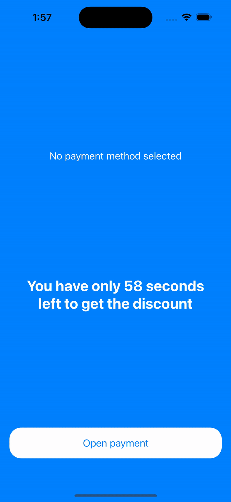

# 💰 SwiftUI-MVVM Discount Flow Template

A clean and modular SwiftUI app demonstrating a time-limited discount flow, built with a custom MVVM architecture and Combine-powered state management. This project showcases unidirectional data flow, modular view models, real-time logic, and clean separation of concerns.

---

## 📱 What This App Does

This app simulates a limited-time offer flow:
1. The user lands on a **countdown screen**.
2. They press **Open payment**, see a modal list of payment methods.
3. They can **search**, **select**, and **confirm** a payment method.
4. Once selected, a **Finish** button appears.
5. After pressing **Finish**, a **Congratulations** screen is shown.

It’s a real-world scenario demo with a ticking timer, custom navigation, modal transitions, and input/state handling.

---

## 🛠 Technologies Used

- ✅ **SwiftUI** – Declarative UI
- ✅ **Combine** – Timers, async logic, filtering, and state bindings
- ✅ **Custom MVVM** – `ViewState`, `ViewInput`, `trigger`, and `AnyViewModel`
- ✅ **Unidirectional Data Flow** – Inspired by TCA/Redux
- ✅ **Custom navigation modifiers** – `.sheetNavigation` & `.navigation`
- ✅ **Fake async API** – Simulated network requests with delay

---

## 📦 MVVM_Base Package

This project uses a lightweight internal library called `MVVM_Base`, developed by the author: [@gormartirosyan](https://github.com/gormartirosyan).  
It contains base view model types, navigation helpers, Combine extensions, custom property wrappers, and more — designed to support this architecture.

_Note: the package is private, so this project may not compile out of the box._

---

## 📂 Project Structure

```
SwiftUI-MVVM/
├── Application/
│   └── SwiftUI_MVVMApp.swift
├── View/
│   ├── Master/
│   │   ├── AppMasterView.swift
│   │   ├── AppMasterViewModel.swift
│   │   └── Components/
│   │       ├── Spinner.swift
│   │       └── NotImplementedView.swift
│   └── Main/
│       ├── Discount/
│       │   ├── DiscountView.swift
│       │   └── DiscountViewModel.swift
│       ├── Payment/
│       │   ├── PaymentView.swift
│       │   └── PaymentViewModel.swift
│       └── Finish/
│           ├── FinishView.swift
│           └── FinishViewModel.swift
├── Model/
│   ├── Services/
│   │   └── PaymentService.swift
│   └── Models/
│       └── PaymentType.swift
├── Data/
│   └── API/
│       ├── Common/API.swift
│       └── Payment/
│           ├── PaymentAPI.swift
│           └── PaymentModel.swift
├── Helpers/
│   ├── Extensions/
│   │   └── Publishers+Ex.swift
│   ├── Preferences.swift
│   └── ViewModelBase.swift
├── Resources/
│   └── ContentViewType.swift
├── Assets.xcassets
├── Info.plist
├── demo/
│   └── demo.gif
├── README.md
└── LICENSE
```

---

## 🖼 Demo



> This short GIF demonstrates the full user flow — from countdown to final confirmation.

---

## ✨ Why Use This Template?

Use this project to:
- Learn how to combine SwiftUI + Combine effectively
- Understand modular MVVM architecture with clean data flow
- Build apps with clear separation of concerns
- Implement custom reusable UI/navigation components

---

## 🔧 Running the App

```bash
git clone https://github.com/gormartirosyan/SwiftUI-MVVM.git
open SwiftUI-MVVM-DiscountFlow.xcodeproj
```

> Note: You’ll need access to the `MVVM_Base` Swift package, or stub it out.

---

## 🧑‍💻 Author

Gor Martirosyan  
[github.com/gormartirosyan](https://github.com/gormartirosyan)  
iOS Developer

---

## 📄 License

Licensed under the [MIT License](LICENSE).
